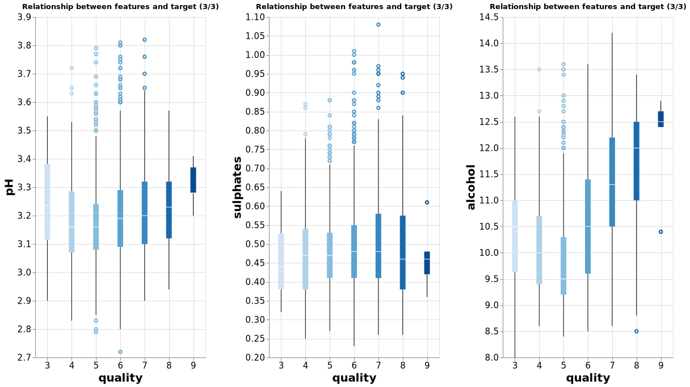
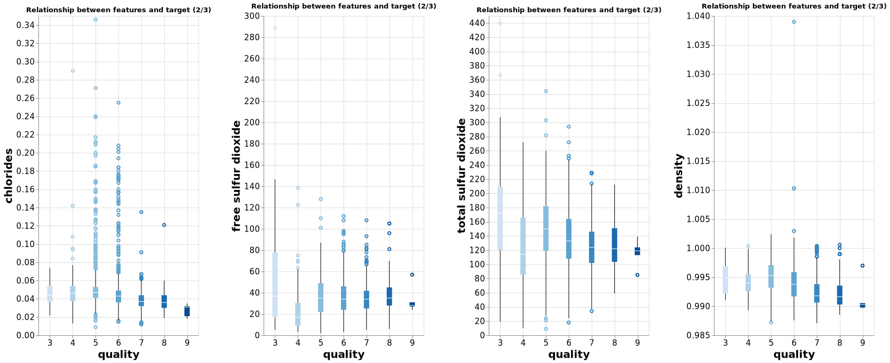
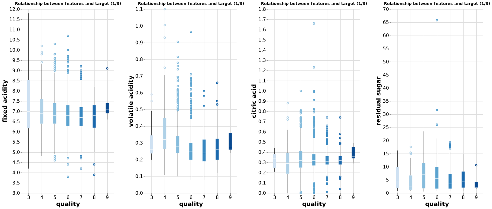
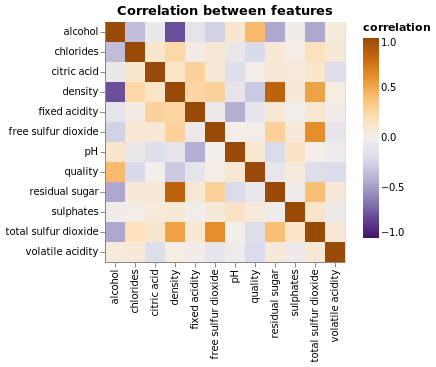

Quality white wine predictor
================

-   [Summary](#summary)
-   [Goal and Research Question](#goal-and-research-question)
-   [Introduction](#introduction)
-   [Data](#data)
-   [Methods](#methods)
-   [Analysis](#analysis)
    -   [Data Cleaning and
        Preprocessing](#data-cleaning-and-preprocessing)
    -   [EDA first conclusions](#eda-first-conclusions)
    -   [Cross Validation and Hyperparameter
        tuning](#cross-validation-and-hyperparameter-tuning)
    -   [Packages](#packages)
-   [Results & Discussion](#results--discussion)
    -   [**Evaluation**](#evaluation)
    -   [**Discussion**](#discussion)
-   [References](#references)

Authors: Nikita Shymberg, Aldo Saltao Barros, Yair Guterman, Son Chau

# Summary

This report trains a machine learning model to predict the quality of
white wine based on physicochemical properties. Our models were trained
on a white wine database from “vinho verde” containing 11 features and a
target “quality”. Quality is a subjective measure, so the values in the
dataset are the average grade of three experts. The quality of wine is a
numeric property, so we trained regression models to predict this value
ranging from 0 (very poor quality) to 10 (very high quality).

We trained several machine learning models and found that a KNN model
with hyperparameters `"distance"` for `weights` and 25 neighbours
performed best during cross validation. This model achieved a score of
0.54 on the test set.

# Goal and Research Question

This project aims to train a model to predict wine quality given
measurable wine features.

# Introduction

According to experts, wine is differentiated according to its smell,
flavour, and colour. Most people are not wine experts, so they cannot
effectively determine that some wine is good or bad. The quality of a
wine is important for consumers as well as the wine industry and it is
determined by a very wide range of factors. For instance, industry
players use product quality certifications to promote their products.
Unfortunately, certification is a time-consuming process and requires
assessment from human experts which makes it very expensive. Nowadays,
it is possible to replace human tasks with machine learning models. In
this case, a good wine quality predictor can be very useful in the
certification process. For example, an automatic predictive system can
be integrated into a decision support system, facilitating quality
certification.

# Data

The wine quality dataset is publicly available on the UCI machine
learning repository (links below). The dataset has two files, red wine
and white wine variants of the Portuguese “Vinho Verde” wine. These
datasets have been widely used by the machine learning community. The
red wine dataset contains 1599 instances and the white wine dataset
contains 4898 instances. We chose to focus solely on white wine because
the white wine dataset has so many more records. Both files contain 11
input features and 1 output feature. Input features are based on the
physicochemical tests and output variable based on sensory data is
scaled in 11 quality classes from 0 to 10 (0-very bad to 10-very good)

-   [UCI
    repository](https://archive.ics.uci.edu/ml/datasets/Wine+Quality)
-   [White wine
    database](http://open.canada.ca/data/en/dataset/b374f60b-9580-44dc-83f6-c0a850c15f30)

Input variables:

1.  **Alcohol**: the alcohol percentage of the wine
2.  **Volatile acidity**: are high acetic acid in wine which leads to an
    unpleasant vinegar taste
3.  **Sulphates**: a wine additive that contributes to SO2 levels and
    acts as an antimicrobial and antioxidant
4.  **Citric Acid**: acts as a preservative to increase acidity (small
    quantities add freshness and flavor to wines)
5.  **Total Sulfur Dioxide**: is the amount of free + bound forms of SO2
6.  **Density**: sweeter wines have a higher density
7.  **Chlorides**: the amount of salt in the wine
8.  **Fixed acidity**: are non-volatile acids that do not evaporate
    readily
9.  **pH**: the level of acidity
10. **Free Sulfur Dioxide**: it prevents microbial growth and the
    oxidation of wine
11. **Residual sugar**: is the amount of sugar remaining after
    fermentation stops. The key is to have a perfect balance between —
    sweetness and sourness (wines \> 45g/ltrs are sweet)

# Methods

For this task, we used python’s scikit learn library (Pedregosa et al.
2011) to train the following models:

1.  **DummyRegressor**: this is a baseline model that merely predicts
    the mean quality for each example without looking at any of the
    features. This should be the worst performing model.
2.  **Ridge**: is a model tuning method that is used to analyse any data
    that suffers from multicollinearity. This method performs L2
    regularization. When the issue of multicollinearity occurs,
    least-squares are unbiased, and variances are large, this results in
    predicted values to be far away from the actual values.
3.  **Random Forest**: is an ensemble learning method for
    classification, regression and other tasks that operates by
    constructing a multitude of decision trees at training time. For
    classification tasks, the output of the random forest is the class
    selected by most trees. For regression tasks, the mean or average
    prediction of the individual trees is returned
4.  **KNN**: is an approach to data classification that estimates how
    likely a data point is to be a member of one group or the other
    depending on what group the data points nearest to it are in.The
    k-nearest-neighbor is an example of a “lazy learner” algorithm,
    meaning that it does not build a model using the training set until
    a query of the data set is performed.
5.  **Bayes**: is an algorithm that uses Bayes’ theorem to classify
    objects. Naive Bayes classifiers assume strong, or naive,
    independence between attributes of data points. Popular uses of
    naive Bayes classifiers include spam filters, text analysis and
    medical diagnosis.
6.  **SVM**: is machine learning algorithm that analyzes data for
    classification and regression analysis. SVM is a supervised learning
    method that looks at data and sorts it into one of two categories.
    An SVM outputs a map of the sorted data with the margins between the
    two as far apart as possible.

# Analysis

### Data Cleaning and Preprocessing

The first step is to clean and prepare the data for analysis.
Fortunately, this dataset is in great condition with no missing values
and only numerical columns. The dataset was split up into two subsets:
the training set and the test set with 80% of the data going into the
training set and the rest into the test set. The training set will be
used to train the models using cross-validation. The test set will only
be used once to report the final scores for the best model.

### EDA first conclusions

According to our first EDA, we do not have a balanced dataset. Around
80% of our wines are concentrated between quality 5 and 7.5. The image
below shows this first finding:

<!-- -->

We also had a look at the distribution between individual features and
the quality to see if there are any obvious features that clearly
contribute to the quality. For instance, it appears that it *might* be
the case that the higher the alcohol, sulphates, and ph levels the
better the wine quality. We can check these information on the chart
below:

<!-- -->

Following the same idea, there is some evidence that the smaller the
chlorides, Free Sulfur Dioxide, total sulphur dioxide and density
levels, the better the wine quality. The chart below ilustrates these
findings:

<!-- -->

For some variables like fixed acidity, volatile acidity, citric acid and
residual sugar seem to not influence wine quality on their own. However,
we need to be careful with this statement since when these variables are
combined with others, they might indeed influence wine quality. The
chart below can shows these findings:

<!-- -->

We also explored the correlations between the features. The heatmap
below shows that some features are indeed correlated. In particular, we
see a strong negative correlation between density and alcohol content.
We also see a very positive correlation between density and residual
sugar.

<!-- -->

### Cross Validation and Hyperparameter tuning

In order to find the best model and perform hyperparameter optimization,
we will use the cross validation approach to support our decision. Cross
validation partitions the training set into 5 folds, trains the model on
4 of them, and evaluates the model on the reserved validation set. This
process is repeated 5 times such that each fold acts as the validation
fold once. Then, we will choose the model and hyperparameters with the
best *R*2 score.

The following hyperparameters were optimized:

DummyRegressor’s `strategy` was set to mean or median

Ridge’s `alpha` for L2 regularization

Random Forest’s `n_estimators` to set the number of trees. The
`criterion` to set the criterion to split the nodes. The `max_depth` of
the trees in the forest. Lastly, whether to use bootstrapping or not.

KNN’s `n_neighbors` to determine how many neighbours get to vote on the
new datapoints score. The `weights` to determine whether closer points
get a bigger vote than further away points.

Bayes’s `alpha_1`, `alpha_2`, `lambda_1`, and `lambda_2`.

SVM’s `kernel` type. The `degree` and the `gamma` and `C` complexity
hyperparameters.

### Packages

We are used the following packages for our analysis: sklearn (Pedregosa
et al. 2011), python (Van Rossum and Drake 2009), pandas (team 2020),
knitr (Xie, n.d.), numpy (Harris et al. 2020), scipy (Virtanen et al.
2020), altair (Sievert 2018), and joblib (Joblib Development Team 2020)

# Results & Discussion

## **Evaluation**

After performing hyperparameter optimization, we found that the best
performing model was the KNN using the `distance` value for the
`weights` hyperparameter and considering the 25 nearest neighbours. As
we can assess into the table below, the KNN has a test *R*2 =
0.54 which is the best value in comparison with the other models

| model |  r2_score | mse_score | rmae_score | mae_score | mse_log_score | mae_log_score |
|:------|----------:|----------:|-----------:|----------:|--------------:|--------------:|
| KNN   | 0.5453724 | 0.3537442 |   0.594764 | 0.3923278 |     0.0081026 |     0.2672034 |

Table 1:

In the context of our business question focusing on the prediction of
white wine quality, it is seems reasonable that KNN gives us superior
“predictions”. We hypothesize that this is because of the fact that the
majority of wines have scores of 5-7, so most datapoints are close to
those scores.

## **Discussion**

By analyzing the physicochemical tests samples data of white wines from
the north of Portugal, we were able to create a model that can help
industry producers, distributors, and sellers to predict the quality of
white wine products and have a better understanding of each critical
feature. The KNN model performed better than others.

It is relevant to mention that there are some limitations for this
analysis. First, the main problem came from the fact that our data set
was unbalanced. A majority of the quality values were around 5 and 6,
which made no significant contribution to finding an optimal model.
These values might made it harder to identify each factor’s different
influence on a “high” or “low” quality of the wine, which was the main
focus of this analysis. In order to improve our predictive model, we
need more balanced data.

Another limitation is that we have only 12 attributes that can narrow
down the accuracy of our predicting quality of white wine. The solution
for this is to include more relevant data features, like the year of
harvest, brew time, etc. So that our *R*2 (0.54) could be
improved, since the value that we obtained is not close to 0.7 or 0.8.
Those are considered, as a rule of thumb, relevant *R*2
values for a regression.

# References

Harris, Charles R., K. Jarrod Millman, Stéfan J van der Walt, Ralf
Gommers, Pauli Virtanen, David Cournapeau, Eric Wieser, et al. 2020.
“Array Programming with NumPy.” *Nature* 585: 357–62.
<https://doi.org/10.1038/s41586-020-2649-2>.

Joblib Development Team. 2020. *Joblib: Running Python Functions as
Pipeline Jobs*. <https://joblib.readthedocs.io/>.

Pedregosa, F., G. Varoquaux, A. Gramfort, V. Michel, B. Thirion, O.
Grisel, M. Blondel, et al. 2011. “Scikit-Learn: Machine Learning in
Python.” *Journal of Machine Learning Research* 12: 2825–30.

Sievert, Jacob VanderPlas AND Brian E. Granger AND Jeffrey Heer AND
Dominik Moritz AND Kanit Wongsuphasawat AND Arvind Satyanarayan AND
Eitan Lees AND Ilia Timofeev AND Ben Welsh AND Scott. 2018. “Altair:
Interactive Statistical Visualizations for Python.” *The Journal of Open
Source Software* 3 (32). <http://idl.cs.washington.edu/papers/altair>.

team, The pandas development. 2020. *Pandas-Dev/Pandas: Pandas* (version
latest). Zenodo. <https://doi.org/10.5281/zenodo.3509134>.

Van Rossum, Guido, and Fred L. Drake. 2009. *Python 3 Reference Manual*.
Scotts Valley, CA: CreateSpace.

Virtanen, Pauli, Ralf Gommers, Travis E. Oliphant, Matt Haberland, Tyler
Reddy, David Cournapeau, Evgeni Burovski, et al. 2020. “SciPy 1.0: Fundamental Algorithms for Scientific
Computing in Python.” *Nature Methods* 17: 261–72.
<https://doi.org/10.1038/s41592-019-0686-2>.

Xie, Yihui. n.d. *Knitr: A General-Purpose Package for Dynamic Report
Generation in r*. <https://yihui.org/knitr/>.

